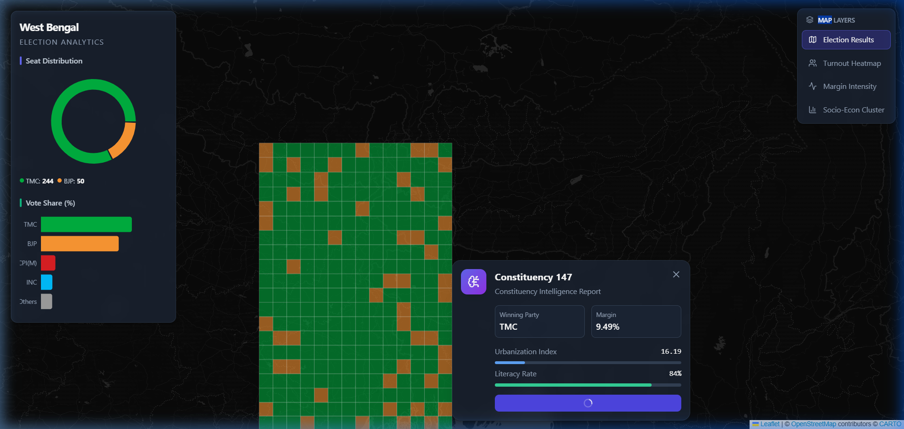

# 🗳️ West Bengal Election Analytics Dashboard




A high-fidelity Election Intelligence Platform that visualizes constituency-level behavior, party dominance, and predictive political analytics for West Bengal.

---

## 🌟 Key Features

1. **🗺️ Interactive Electoral Map**: Full West Bengal constituency mapping with hover tooltips and dynamic color-coding by winning party.
2. **📊 Advanced Map Layers**: Toggle between Election Results, Turnout Heatmap, Margin Intensity, and Socio-Economic clusters.
3. **🤖 Machine Learning Intelligence Engine**: Click any constituency to run a Random Forest model predicting the likely winning party based on socio-economic features.
4. **📈 Analytics Dashboard**: Visual representations of seat distribution and vote shares.

---

## 🛠️ Architecture

*   **Frontend**: React + TypeScript + Vite + Tailwind CSS + Leaflet.js
*   **Backend**: Python FastAPI
*   **Machine Learning**: Scikit-learn (Random Forest, K-Means Clustering)
*   **Data Generation**: Custom Python scripts generating 294 synthetic constituencies with demographics and election metrics.

---

## 💻 Local Development Setup

### 1. Data Generation & ML Training
If you wish to re-generate the dataset and re-train the models:
```bash
cd backend
pip install -r requirements.txt
cd ../data_generation
python generate_data.py
```

### 2. Start Backend API
```bash
cd backend
pip install -r requirements.txt
python main.py
```
*The API will run on `http://localhost:8000`.*

### 3. Start Frontend
```bash
cd frontend
npm install
npm run dev
```
*Open your browser to `http://localhost:5173`.*

---

## 🚀 Deployment Guide (Web)

To deploy this application to production, you need to deploy the Frontend and Backend separately.

### Option A: Vercel (Frontend) + Render/Heroku (Backend)

#### Deploying the Backend (Render.com)
1. Push this repository to GitHub.
2. Create an account on [Render](https://render.com/).
3. Create a new **Web Service** and connect your GitHub repository.
4. Set the **Root Directory** to `backend`.
5. Set the **Build Command** to: `pip install -r requirements.txt`.
6. Set the **Start Command** to: `uvicorn main:app --host 0.0.0.0 --port $PORT`.
7. Render will provide you with a URL (e.g., `https://wb-election-api.onrender.com`).

#### Deploying the Frontend (Vercel)
1. Before deploying, update `frontend/src/api.ts` to point to your new backend URL instead of `http://localhost:8000`.
   ```typescript
   // frontend/src/api.ts
   const api = axios.create({
     baseURL: 'https://wb-election-api.onrender.com/api', // <-- Update this
   });
   ```
2. Create an account on [Vercel](https://vercel.com/).
3. Click **Add New Project** and import your GitHub repository.
4. Set the **Framework Preset** to Vite.
5. Set the **Root Directory** to `frontend`.
6. Click **Deploy**. Vercel will automatically build and host your React application.

### Option B: Full-Stack on Railway / DigitalOcean App Platform
Platforms like [Railway](https://railway.app/) allow you to deploy mono-repos easily. You can define two separate services within the same project (one pointing to the `/frontend` directory using Node.js, and one pointing to the `/backend` directory using Python).

---

## 📜 License
MIT License. Feel free to use this for research, journalism, or personal projects!
